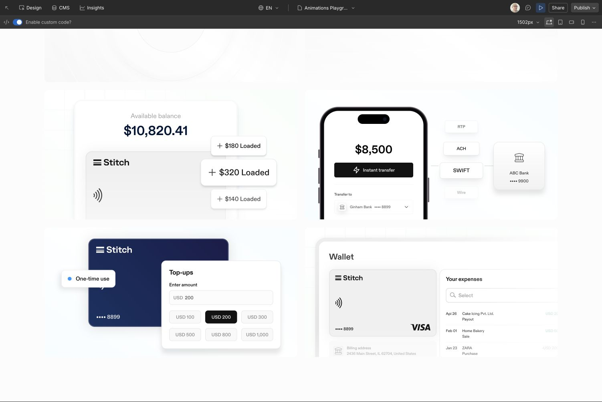
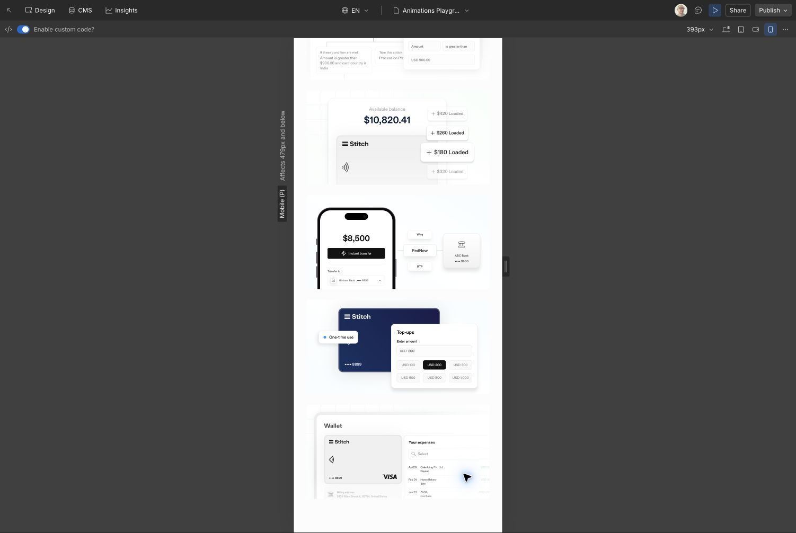

# Digital Wallets illustrations staging release — 2026-10-07

Scope: Digital Wallet, Peer-to-Peer Transfers, Top-ups and Wallet Graphic. Include all supporting sources, original SVG assets, preview fixtures, reusable Upward Carousel, component/effect documentation, draft screenshots, tests and fresh distribution artifacts.

Prepared against current origin/main `de2de02`. `npm run validate:release` passes: 97 tests, complete shared build and dependency closure; Product Variety/wallet swap and Country Flags remain included. Restored unrelated Consumer Verification portable embeds after the aggregate builder removed them. Retained established carousel timing (6×duration hold, 4×duration move) so extracting the sampler does not alter Revolving Credit.

Saved site-wide and Playground footer routers were read and confirmed unchanged, selecting staging for Preview/staging and production for the four production hosts. All four native graphics are currently saved in Playground. User confirmed Playground-only delivery; Digital Wallets retains its previous illustrations. Production publication and promotion are not authorized.

GitHub PR: https://github.com/gorankomar/stitch-animations/pull/34 merged all 63 changed/new files. Animation release SHA: `63198d21e27cc21fe8bee99598713257a1e265dd`.

Workflow https://github.com/gorankomar/stitch-animations/actions/runs/37654962239 completed successfully. It verified 199 release files, checksums/MIME/CORS for staging, activated staging from `de2de02a2615e7a96152b1009d1470865d90eda4`, and completed invalidation/served-loader verification at 16:49:47 UTC. Independent reads confirm staging imports the new SHA; production still imports `418f5b3456270c678384990e6db49ffb70c8e175`.

Webflow single-page publication rejected with HTTP 400 (`Invalid parameter: pageId`). Playground was staged for publication through its Draft menu. Automatic approval review rejected full-site staging publication because it may include pending changes beyond Playground. User clarified the intended workflow: GitHub merge and staging animation activation, with the four illustrations checked in Playground Preview; Webflow page publication is unnecessary and explicitly declined. No Webflow site or page publication was performed. Playground is staged for publication, and production remains unchanged. Playground Preview verification completed after custom-code compilation. Exactly one `stitch-code-page-loader` points to the permanent staging channel. Desktop parents measure 630 × 324.328; mobile parents measure 345 × 177.609, preserving 540:278. Digital Wallet and P2P set their ready guards, reach $10,820.41/$8,500, and visibly cycle through the spare amounts/ACH/SWIFT. Top-ups sets its ready guard and all three layers finish visible. Wallet reveal targets finish at opacity 1 (grid .43), with primary-curve 770ms movement and 262ms linear opacity. Desktop and mobile screenshots are saved below.

Reduced-motion restoration is covered by the passing lifecycle/reveal tests; OS preference was not changed in Webflow Preview. Console inspection includes pre-existing Designer SVG warnings, unrelated tracker fetch/compile messages, and site Docs/navbar code errors on the Playground (which lacks those page elements); no changes were made to unrelated custom code. These do not prevent the verified four animation controllers.

The evidence-only follow-up commit has identical animation source/dist to the verified release; its main workflow may activate a new SHA containing the same animation bytes.
