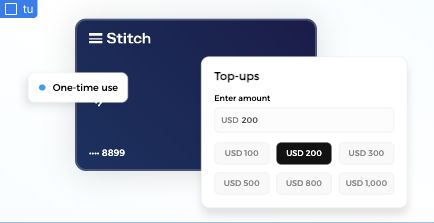

# Top-ups — saved draft, 2026-10-07

Created native reusable Webflow Top-ups component `e4c49191-e169-4d20-a184-5c4143105848` in Animations Playground. Preserved established Dark Blue Credit Card and replaced the decorative dot with a native rounded HTML element at user request. All appearance uses native styles. Component details: [TOP-UPS.md](../../src/embeds/TOP-UPS.md).

Requested reveals and Pointer Follow are implemented/tested locally and registered with shared entries. No staging merge/channel activation, Webflow publication or production promotion was requested/performed. Existing permanent loaders and unrelated drafts/code remain unchanged. Webflow Preview currently shows the complete static fallback; runtime activation requires an authorized staging release.

Verified Webflow desktop Preview (630 × 324.328) and mobile Designer (345 × 177.609), plus two simultaneous local parent widths, complete missing-module fallback and pointer movement on every layer. Five new lifecycle/schedule tests and three reveal regression tests pass. Temporary shared build and dependency check pass. Full suite has four failures in unrelated concurrent carousel work (Digital Wallet and Revolving Credit), 93/97 passing.

